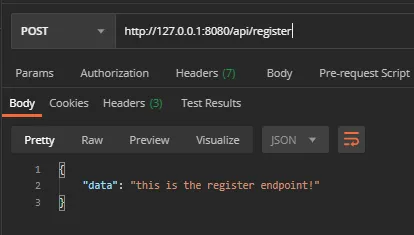
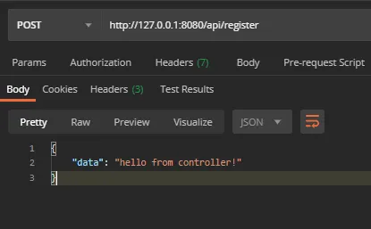
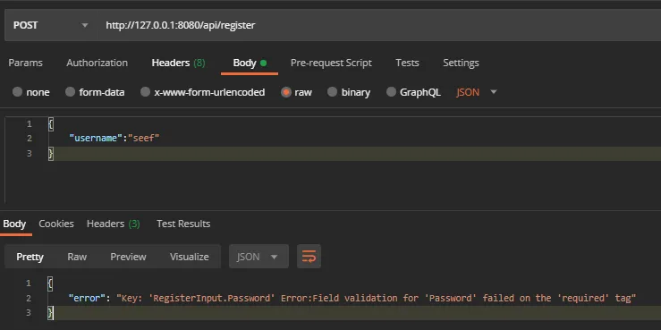
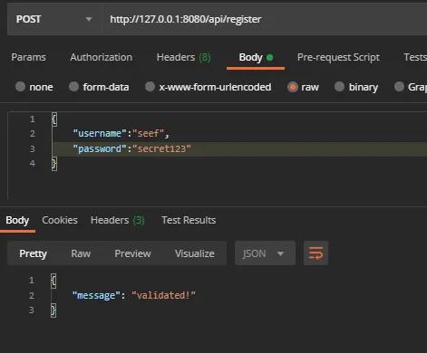
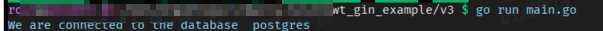
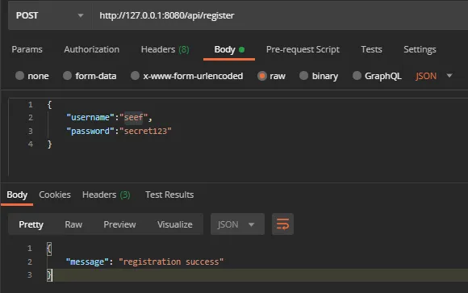
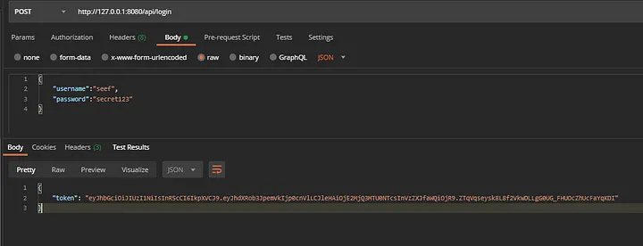
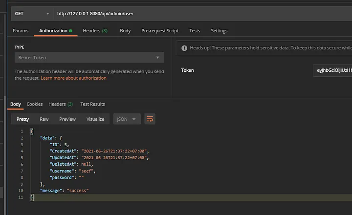

<h1 align="center"> Gin JWT Example</h1>

<p align="center">
    <a href="README.MD"></a>
    <a href="README_zh.MD"></a>
    <br>
    <br>
</p>

### What is JSON Web Token?

JSON Web Token (JWT) is an open standard (RFC 7519) that defines a compact and self-contained way for securely transmitting information between parties as a JSON object. This information can be verified and trusted because it is digitally signed. JWTs can be signed using a secret (with the HMAC algorithm) or a public/private key pair using RSA or ECDSA.

Although JWTs can be encrypted to also provide secrecy between parties, we will focus on signed tokens. Signed tokens can verify the integrity of the claims contained within it, while encrypted tokens hide those claims from other parties. When tokens are signed using public/private key pairs, the signature also certifies that only the party holding the private key is the one that signed it.

<br/>

### Our simple REST API Design

so for this project, we will need to create 2 public endpoints that will be used as authentication and 1 protected endpoint that will be protected by our JWT

<br/>

#### Login

this route will be used to authenticate the user by providing a username and password then generate and gives JSON Web Token in return

```sh
/api/login
```

<br/>

#### Register

of course, because we have a login route earlier we need a way to register our login information, so it can be verified.

```sh
/api/register
```

<br/>

for the sake of this tutorial, we will leave the registration route open. If you don't want people to be able to gain login access easily you might not want to do this.

#### Protecter Route

this whil be the route for out protected endpoints

```sh
/api/admin/user
```

<br/>

#### Getting Started

to initiate our project we want to create our project dir folder and going into the directory

```sh
mkdir jwt-gin
cd jwt-gin
```

<br/>

we can start by initiating our go.mod file to manage packages that we will be installing later on.

```sh
go mod init <your_project_name>
```

<br/>

here’s the list of packages that we will need to install for this project.

```sh
// gin framework
go get -u github.com/gin-gonic/gin
// ORM library
go get -u github.com/jinzhu/gorm
// package that we will be used to authenticate and generate our JWT
go get -u github.com/dgrijalva/jwt-go
// to help manage our environment variables
go get -u github.com/joho/godotenv
// to encrypt our user's password
go get -u golang.org/x/crypto
```

<br/>

Alright.. now that everything is set, we can start coding our application!

<br/>

### Creating our first endpoint

we can start by creating our main.go file in our root directory

```sh
touch main.go
```

<br/>

here is the code for our starter public endpoint

```golang
package main

import (
    "net/http"

    "github.com/gin-gonic/gin"
)

func main() {

    r := gin.Default()

    public := r.Group("/api")

    public.POST("/register", func(c *gin.Context) {
        c.JSON(http.StatusOK, gin.H{"data": "this is the register endpoint!"})
    })

    r.Run(":8080")

}

```

<br/>

and we can try to run it.



<br/>

Perfect! it seems our register endpoint is working properly.

<br/>

### Creating Register Endpoint

Now that our register endpoint is ready, we can start creating our controller file that will contain our logic for the registration process.

create controller package dir

```sh
mkdir controllers
```

<br/>

create controller file for our login that will be named auth.go

```sh
touch ./controllers/auth.go
```

```golang
package controllers

import (
    "net/http"

    "github.com/gin-gonic/gin"
)

func Register(c *gin.Context) {
    c.JSON(http.StatusOK, gin.H{"data": "hello from controller!"})
}
```

<br/>

and we also have to update our main.go file

```golang
package main

import (
      "github.com/gin-gonic/gin"
    "<your_project_name>/controllers"
)

func main() {

    r := gin.Default()
    
    public := r.Group("/api")

    public.POST("/register", controllers.Register)

    r.Run(":8080")

}
```

<br/>

now let's test it again!




Perfect!

<br/>

### Validation

we need to validate inputs that are coming into our register endpoint, the only input we will need are username and password.

we will be using a validation feature that comes with gin which is called **binding**

if you want to know more about [binding](https://github.com/gin-gonic/gin#model-binding-and-validation) and [validator](https://github.com/gin-gonic/gin#model-binding-and-validation)

let's update our `auth.go` file

```golang
package controllers

import (
    "net/http"
  "github.com/gin-gonic/gin"
)


type RegisterInput struct {
    Username string `json:"username" binding:"required"`
    Password string `json:"password" binding:"required"`
}

func Register(c *gin.Context){
    
    var input RegisterInput

    if err := c.ShouldBindJSON(&input); err != nil {
        c.JSON(http.StatusBadRequest, gin.H{"error": err.Error()})
        return
    }

    c.JSON(http.StatusOK, gin.H{"message": "validated!"})   

}
```

<br/>

let's test our validation!

missing password input test:



<br/>
correct input test



<br/>

### Database Connection and Model

To save our credentials in our database, we need to create a database connection to our desired database, I will be using Postgres database that is already installed in my system.

<br/>

let's create `models` package

```sh
mkdir models
```

this folder will contain the database connection file and all our models

<br/>

database connection file

```sh
touch ./models/setup.go
```

```golang
package models

import (
    "database/sql"
    "fmt"
    "log"
    "os"

    "github.com/jinzhu/gorm"

    "github.com/joho/godotenv"
    _ "github.com/lib/pq" // postgresql 驱动
)

var DB *gorm.DB

func ConnectDataBase() {

    err := godotenv.Load(".env")

    if err != nil {
        log.Fatalf("Error loading .env file")
    }

    DbDriver := os.Getenv("DB_DRIVER")
    DbHost := os.Getenv("DB_HOST")
    DbUser := os.Getenv("DB_USER")
    DbName := os.Getenv("DB_NAME")
    DbPort := os.Getenv("DB_PORT")
    DbPassword := os.Getenv("DB_PASSWORD")

    // 创建数据库连接
    db, err := sql.Open(DbDriver, fmt.Sprintf("%s://%s:%s@%s:%s/%s?sslmode=disable", DbDriver, DbUser, DbPassword, DbHost, DbPort, DbName))

    if err != nil {
        panic(err)
    }

    DB, err = gorm.Open(DbDriver, db)

    if err != nil {
        fmt.Println("Cannot connect to database ", DbDriver)
        log.Fatal("connection error:", err)
    } else {
        fmt.Println("We are connected to the database ", DbDriver)
    }

    DB.AutoMigrate(&User{})

}

// Cleanup, db connect closed after exits
func Cleanup() {
    if DB != nil {
        _ = DB.Close()
    }
}
```

<br/>

Alright as you can notice in the setup.go file we will need 2 things

1. env file
2. User Model

<br/>

#### Creeating .env file

we can create the `.env `file by simply creating it in our root directory

```sh
touch .env
```

```sh
DB_HOST=127.0.0.1                       
DB_DRIVER=postgres                          
DB_USER=postgres
DB_PASSWORD=abc1221
DB_NAME=jwt-gin-v3
DB_PORT=15432
```

<br/>

#### Making User Model

```sh
touch ./models/user.go
```

```golang
package models

import (
    "github.com/jinzhu/gorm"
)

type User struct {
    gorm.Model
    Username string `gorm:"size:255;not null;unique" json:"username"`
    Password string `gorm:"size:255;not null;" json:"password"`
}
```

<br/>

Alright, now that our database connection is set let's add it to our main.go file and test it!

```golang
package main

import (
      "github.com/gin-gonic/gin"
      "<your_project_name>/controllers"
      "<your_project_name>/models"
)

func main() {

    models.ConnectDataBase()
    
    r := gin.Default()

    public := r.Group("/api")

    public.POST("/register", controllers.Register)

    r.Run(":8080")

}
```

<br/>

this is what you should see in your terminal




Perfect! now we can save the credential into the database

<br/>

let's update out `auth.go` file

```golang
package controllers

import (
    "net/http"
      "github.com/gin-gonic/gin"
    "<your_project_name>/models"
)


type RegisterInput struct {
    Username string `json:"username" binding:"required"`
    Password string `json:"password" binding:"required"`
}

func Register(c *gin.Context){
    
    var input RegisterInput

    if err := c.ShouldBindJSON(&input); err != nil {
        c.JSON(http.StatusBadRequest, gin.H{"error": err.Error()})
        return
    }

    u := models.User{}

    u.Username = input.Username
    u.Password = input.Password

    _,err := u.SaveUser()

    if err != nil{
        c.JSON(http.StatusBadRequest, gin.H{"error": err.Error()})
        return
    }

    c.JSON(http.StatusOK, gin.H{"message":"registration success"})

}
```

<br/>

in order to save our User data we need to create the `SaveUser()` function in our User model but we also need to create [gorm hooks](https://gorm.io/docs/hooks.html) `BeforeSave()` function that will be running the hash process to the user’s password.

<br/>

let's update ourt `user.go` file

```golang
package models

import (
    "html"
    "strings"
    
    "github.com/jinzhu/gorm"
    "golang.org/x/crypto/bcrypt"
)

type User struct {
    gorm.Model
    Username string `gorm:"size:255;not null;unique" json:"username"`
    Password string `gorm:"size:255;not null;" json:"password"`
}

func (u *User) SaveUser() (*User, error) {

    var err error
    err = DB.Create(&u).Error
    if err != nil {
        return &User{}, err
    }
    return u, nil
}

// 钩子事件，用户存入数据之前的操作
func (u *User) BeforeSave() error {

    //turn password into hash
    hashedPassword, err := bcrypt.GenerateFromPassword([]byte(u.Password),bcrypt.DefaultCost)
    if err != nil {
        return err
    }
    u.Password = string(hashedPassword)

    //remove spaces in username 
    u.Username = html.EscapeString(strings.TrimSpace(u.Username))

    return nil

}
```

<br/>

Let's test it!



<br/>

Perfect, It means the credential is saved and hashed and we can use it to validate the login process!

<br/>

#### Creating Login Endpoint

what our login endpoint going to do is very simple, it will receive a username and password, check whether it matches the credential in our database, if it does return a `token`, if it doesn’t return an error response.

<br/>

let's add a new route to our `main.go`

```golang
package main

import (
      "github.com/gin-gonic/gin"
    "<your_project_name>/controllers"
    "<your_project_name>/models"
)

func main() {

    models.ConnectDataBase()
    
    r := gin.Default()

    public := r.Group("/api")

    public.POST("/register", controllers.Register)
    public.POST("/login",controllers.Login)

    r.Run(":8080")

}
```

<br/>

add Login function in auth.go controller

```golang
package controllers

import (
    "net/http"
      "github.com/gin-gonic/gin"
    "<your_project_name>/models"
)

type LoginInput struct {
    Username string `json:"username" binding:"required"`
    Password string `json:"password" binding:"required"`
}

func Login(c *gin.Context) {
    
    var input LoginInput

    if err := c.ShouldBindJSON(&input); err != nil {
        c.JSON(http.StatusBadRequest, gin.H{"error": err.Error()})
        return
    }

    u := models.User{}

    u.Username = input.Username
    u.Password = input.Password

    token, err := models.LoginCheck(u.Username, u.Password)

    if err != nil {
        c.JSON(http.StatusBadRequest, gin.H{"error": "username or password is incorrect."})
        return
    }

    c.JSON(http.StatusOK, gin.H{"token":token})

}

// 注册接口参数
type RegisterInput struct {
    Username string `json:"username" binding:"required"`
    Password string `json:"password" binding:"required"`
}

func Register(c *gin.Context){
    
    var input RegisterInput

    if err := c.ShouldBindJSON(&input); err != nil {
        c.JSON(http.StatusBadRequest, gin.H{"error": err.Error()})
        return
    }

    u := models.User{}

    u.Username = input.Username
    u.Password = input.Password

    _,err := u.SaveUser()

    if err != nil{
        c.JSON(http.StatusBadRequest, gin.H{"error": err.Error()})
        return
    }

    c.JSON(http.StatusOK, gin.H{"message":"registration success"})

}
```

<br/>

the Login controller function will call LoginCheck function from `user.go`

<br/>

lets add it to our `user.go` file

```golang
package models

import (
    "html"
    "strings"
    
    "github.com/jinzhu/gorm"
    "golang.org/x/crypto/bcrypt"
    "<your_project_name>/utils/token"
)

type User struct {
    gorm.Model
    Username string `gorm:"size:255;not null;unique" json:"username"`
    Password string `gorm:"size:255;not null;" json:"password"`
}

// 密码校验
func VerifyPassword(password,hashedPassword string) error {
    return bcrypt.CompareHashAndPassword([]byte(hashedPassword), []byte(password))
}

// 登录检查
func LoginCheck(username string, password string) (string,error) {
    
    var err error

    u := User{}

    err = DB.Model(User{}).Where("username = ?", username).Take(&u).Error

    if err != nil {
        return "", err
    }

    err = VerifyPassword(password, u.Password)

    if err != nil && err == bcrypt.ErrMismatchedHashAndPassword {
        return "", err
    }

    token,err := token.GenerateToken(u.ID)

    if err != nil {
        return "",err
    }

    return token,nil
    
}

func (u *User) SaveUser() (*User, error) {

    var err error
    err = DB.Create(&u).Error
    if err != nil {
        return &User{}, err
    }
    return u, nil
}

func (u *User) BeforeSave() error {

    //turn password into hash
    hashedPassword, err := bcrypt.GenerateFromPassword([]byte(u.Password),bcrypt.DefaultCost)
    if err != nil {
        return err
    }
    u.Password = string(hashedPassword)

    //remove spaces in username 
    u.Username = html.EscapeString(strings.TrimSpace(u.Username))

    return nil

}
```

<br/>

we also need to create `token.go` file that will contain all of our token processing functions, we will create a new directory which is called utils

```sh
mkdir utils
mkdir ./utils/token
touch ./utils/token/token.go
```

<br/>

here’s `token.go` file along with several functions that we will be using later on as well.

```golang
type User struct {
    gorm.Model
    Username string `gorm:"size:255;not null;unique" json:"username"`
    Password string `gorm:"size:255;not null;" json:"password"`
}

// VerifyPassword, verity is pass by password hash
func VerifyPassword(password, hashedPassword string) error {
    return bcrypt.CompareHashAndPassword([]byte(hashedPassword), []byte(password))
}

// 登录检查
func LoginCheck(username string, password string) (string, error) {

    var (
        err error
        u   = User{}
    )

    if err := DB.Model(User{}).Where("username = ?", username).Take(&u).Error; err != nil {
        return "", err
    }

    err = VerifyPassword(password, u.Password)
    if err != nil && err == bcrypt.ErrMismatchedHashAndPassword {
        return "", err
    }

    if tokenStr, err := token.GenerateToken(u.ID); err != nil {
        return "", err
    } else {
        return tokenStr, nil
    }

}

func (u *User) SaveUser() (*User, error) {

    var err error
    err = DB.Create(&u).Error
    if err != nil {
        return &User{}, err
    }
    return u, nil
}

func (u *User) BeforeSave() error {

    //turn password into hash
    hashedPassword, err := bcrypt.GenerateFromPassword([]byte(u.Password), bcrypt.DefaultCost)
    if err != nil {
        return err
    }
    u.Password = string(hashedPassword)

    //remove spaces in username
    u.Username = html.EscapeString(strings.TrimSpace(u.Username))

    return nil
}
```

<br/>

we also need to add 2 new variables into our `.env` file

```sh
API_SECRET=yoursecretstring
TOKEN_HOUR_LIFESPAN=1
```

<br/>

`TOKEN_HOUR_LIFESPAN` will determine how long each token will last (hour
`API_SECRET` is your own secret string for signing the token

<br/>

let's run and test our Login




Perfect！

<br/>

### Creating JWT Authentication Middleware

lets create our `middleware.go` file

```sh
mkdir middlewares
touch ./middlewares/middlewares.go
```

```golang
package middlewares

import (
    "net/http"

    "github.com/gin-gonic/gin"
    "<your_project_name>/utils/token"
)

func JwtAuthMiddleware() gin.HandlerFunc {
    return func(c *gin.Context) {
        err := token.TokenValid(c)
        if err != nil {
            c.String(http.StatusUnauthorized, "Unauthorized")
            c.Abort()
            return
        }
        c.Next()
    }
}
```

<br/>

let's implement to our middleware to our `main.go`

```golang
package main

import (
      "github.com/gin-gonic/gin"
    "<your_project_name>/controllers"
    "<your_project_name>/models"
    "<your_project_name>/middlewares"
)

func main() {

    models.ConnectDataBase()
    
    r := gin.Default()

    public := r.Group("/api")

    public.POST("/register", controllers.Register)
    public.POST("/login",controllers.Login)

    protected := r.Group("/api/admin")
    // 以下接口将需要使用jwt进行认证
    protected.Use(middlewares.JwtAuthMiddleware())
    protected.GET("/user",controllers.CurrentUser)

    r.Run(":8080")

}
```

<br/>

lets add **CurrentUser** function in our **auth.go** file so we can return the current authenticated user data.

```golang
package controllers

import (
    "net/http"
      "github.com/gin-gonic/gin"
    "<your_project_name>/models"
    "<your_project_name>/utils/token"
)

func CurrentUser(c *gin.Context){

    user_id, err := token.ExtractTokenID(c)
    
    if err != nil {
        c.JSON(http.StatusBadRequest, gin.H{"error": err.Error()})
        return
    }
    
    u,err := models.GetUserByID(user_id)
    
    if err != nil {
        c.JSON(http.StatusBadRequest, gin.H{"error": err.Error()})
        return
    }

    c.JSON(http.StatusOK, gin.H{"message":"success","data":u})
}

type LoginInput struct {
    Username string `json:"username" binding:"required"`
    Password string `json:"password" binding:"required"`
}

func Login(c *gin.Context) {
    
    var input LoginInput

    if err := c.ShouldBindJSON(&input); err != nil {
        c.JSON(http.StatusBadRequest, gin.H{"error": err.Error()})
        return
    }

    u := models.User{}

    u.Username = input.Username
    u.Password = input.Password

    token, err := models.LoginCheck(u.Username, u.Password)

    if err != nil {
        c.JSON(http.StatusBadRequest, gin.H{"error": "username or password is incorrect."})
        return
    }

    c.JSON(http.StatusOK, gin.H{"token":token})

}


type RegisterInput struct {
    Username string `json:"username" binding:"required"`
    Password string `json:"password" binding:"required"`
}

func Register(c *gin.Context){
    
    var input RegisterInput

    if err := c.ShouldBindJSON(&input); err != nil {
        c.JSON(http.StatusBadRequest, gin.H{"error": err.Error()})
        return
    }

    u := models.User{}

    u.Username = input.Username
    u.Password = input.Password

    _,err := u.SaveUser()

    if err != nil{
        c.JSON(http.StatusBadRequest, gin.H{"error": err.Error()})
        return
    }

    c.JSON(http.StatusOK, gin.H{"message":"registration success"})

}
```

<br/>

lets add **GetUserByID** function into our **user.go**

```golang
package models

import (
    "errors"
    "html"
    "strings"

    "github.com/jinzhu/gorm"
    "golang.org/x/crypto/bcrypt"
    "jwt-gin-example/utils/token"
)

type User struct {
    gorm.Model
    Username string `gorm:"size:255;not null;unique" json:"username"`
    Password string `gorm:"size:255;not null;" json:"password"`
}

// VerifyPassword, verity is pass by password hash
func VerifyPassword(password, hashedPassword string) error {
    return bcrypt.CompareHashAndPassword([]byte(hashedPassword), []byte(password))
}

// GetUserByID, get user detail info but expect password by user ID
func GetUserByID(uid uint) (User, error) {

    var u User
    if err := DB.First(&u, uid).Error; err != nil {
        return u, errors.New("user not found ")
    }

    u.PrepareGive()

    return u, nil

}

func (u *User) PrepareGive() {
    u.Password = ""
}

// 登录检查
func LoginCheck(username string, password string) (string, error) {

    var (
        err error
        u   = User{}
    )

    if err := DB.Model(User{}).Where("username = ?", username).Take(&u).Error; err != nil {
        return "", err
    }

    err = VerifyPassword(password, u.Password)
    if err != nil && err == bcrypt.ErrMismatchedHashAndPassword {
        return "", err
    }

    if tokenStr, err := token.GenerateToken(u.ID); err != nil {
        return "", err
    } else {
        return tokenStr, nil
    }

}

func (u *User) SaveUser() (*User, error) {

    var err error
    err = DB.Create(&u).Error
    if err != nil {
        return &User{}, err
    }
    return u, nil
}

func (u *User) BeforeSave() error {

    //turn password into hash
    hashedPassword, err := bcrypt.GenerateFromPassword([]byte(u.Password), bcrypt.DefaultCost)
    if err != nil {
        return err
    }
    u.Password = string(hashedPassword)

    //remove spaces in username
    u.Username = html.EscapeString(strings.TrimSpace(u.Username))

    return nil

}
```

<br/>

you can also notice we ran **PrepareGive** function to remove the hashed password string before returning it for security purposes.

<br/>

let's test our protected endpoint



<br/>

Perfect!

<br/>

By that, it will conclude the tutorial. I hope it helps you on your personal journey as a developer.

