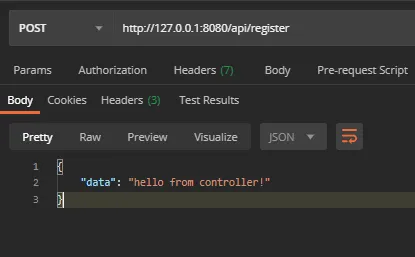

<h1 align="center"> Gin JWT Example</h1>

<p align="center">
    <a href="README.MD"></a>
    <a href="README_zh.MD"></a>
    <br>
    <br>
</p>

### JWT是什么

JSON Web Token (JWT) 是一个开放标准 ([RFC 7519](https://tools.ietf.org/html/rfc7519))，它定义了一种紧凑、独立的方式，可以用 JSON 对象在双方之间安全地传输信息。由于经过了数字签名，因此这些信息是可以验证和信任的。JWT 可以使用密钥（使用 HMAC 算法）或使用 RSA 或 ECDSA 的公钥/私钥对进行签名。


尽管 JWT 可以加密以在双方之间提供机密性，但我们将重点关注签名令牌。签名令牌可以验证其包含的声明的完整性，而加密令牌则可以对其他方隐藏这些声明。当使用公钥/私钥对签名令牌时，签名还证明只有持有私钥的一方才能对其进行签名。


### 我们的简单 REST API 设计

所以对于这个项目，我们需要创建 2 个公共接口，它们将用作身份验证，以及 1 个受我们的 JWT 保护的受保护端点(接口)


#### 登录

该路由将用于通过提供用户名和密码来验证用户身份，然后生成并返回 JSON Web 令牌

```sh
/api/login
```

<br/>

#### 注册

当然，因为我们之前有登录路由，所以我们需要一种方法来注册我们的登录信息，以便可以对其进行验证

```sh
/api/register
```

<br/>

为了本教程的目的，我们将保留注册路径。如果您不希望人们能够轻松获得登录访问权限，您可能不想这样做。

<br/>

#### 受保护的路由

这将是我们受保护端点的路由

```sh
/api/admin/user
```

<br/>

#### 入门

要启动我们的项目，我们要创建项目目录文件夹并进入该目录

```sh
mkdir jwt-gin
cd jwt-gin
```

<br/>

我们可以首先启动 go.mod 文件来管理稍后需要安装的包。

```sh
go mod init <your_project_name>
```

<br/>

这是我们需要为此项目安装的软件包列表

```sh
// gin framework
go get -u github.com/gin-gonic/gin
// ORM library
go get -u github.com/jinzhu/gorm
// package that we will be used to authenticate and generate our JWT
go get -u github.com/dgrijalva/jwt-go
// to help manage our environment variables
go get -u github.com/joho/godotenv
// to encrypt our user's password
go get -u golang.org/x/crypto
```


好吧..既然一切都准备好了，我们可以开始编写我们的应用程序了！


### 创建我们第一个接口端点

我们可以首先在根目录中创建 `main.go` 文件

```sh
touch main.go
```

<br/>

这是我们的入门公共端点的代码

```golang
package main

import (
    "net/http"

    "github.com/gin-gonic/gin"
)

func main() {

    r := gin.Default()

    public := r.Group("/api")

    public.POST("/register", func(c *gin.Context) {
        c.JSON(http.StatusOK, gin.H{"data": "this is the register endpoint!"})
    })

    r.Run(":8080")

}
```

并且我们可以尝试运行它。


很棒！看起来我们的注册端点工作正常


### 创建注册接口

现在我们的注册接口已准备就绪，我们可以开始创建控制器文件，其中将包含注册过程的逻辑。

创建 controller 包目录

```sh
mkdir controllers
```


为我们的登录创建名为 auth.go 的控制器文件

```sh
touch ./controllers/auth.go
```

```golang
package controllers

import (
    "net/http"

    "github.com/gin-gonic/gin"
)

func Register(c *gin.Context) {
    c.JSON(http.StatusOK, gin.H{"data": "hello from controller!"})
}
```


我们还必须更新 main.go 文件

```golang
package main

import (
      "github.com/gin-gonic/gin"
    "<your_project_name>/controllers"
)

func main() {

    r := gin.Default()
    
    public := r.Group("/api")

    public.POST("/register", controllers.Register)

    r.Run(":8080")

}
```


现在让我们在测试一次




完美！


### 验证

我们需要验证传入注册接口的输入，我们需要的唯一输入是用户名和密码。

我们将使用 gin 附带的 验证功能，称为绑定

如果您想了解有关 [绑定](https://github.com/gin-gonic/gin#model-binding-and-validation) 和 [验证器](https://github.com/gin-gonic/gin#model-binding-and-validation) 的更多信息

<br/>

让我们更新 `auth.go` 文件

```golang
package controllers

import (
    "net/http"
  "github.com/gin-gonic/gin"
)


type RegisterInput struct {
    Username string `json:"username" binding:"required"`
    Password string `json:"password" binding:"required"`
}

func Register(c *gin.Context){
    
    var input RegisterInput

    if err := c.ShouldBindJSON(&input); err != nil {
        c.JSON(http.StatusBadRequest, gin.H{"error": err.Error()})
        return
    }

    c.JSON(http.StatusOK, gin.H{"message": "validated!"})   

}
```

<br/>

让我们测试一下我们的验证！

<br/>

缺少密码的输入测试


正确输入的测试


<br/>

### 数据库连接和模型

为了将我们的凭据保存在数据库中，我们需要创建到所需数据库的数据库连接，我将使用系统中已安装的 Postgres 数据库。

<br/>

让我们创建 `model` 包

```sh
mkdir models
```

该文件夹将包含数据库连接文件和我们所有的模型

<br/>

数据库连接文件

```sh
touch ./models/setup.go
```

```golang
package models

import (
    "database/sql"
    "fmt"
    "log"
    "os"

    "github.com/jinzhu/gorm"

    "github.com/joho/godotenv"
    _ "github.com/lib/pq" // postgresql 驱动
)

var DB *gorm.DB

func ConnectDataBase() {

    err := godotenv.Load(".env")

    if err != nil {
        log.Fatalf("Error loading .env file")
    }

    DbDriver := os.Getenv("DB_DRIVER")
    DbHost := os.Getenv("DB_HOST")
    DbUser := os.Getenv("DB_USER")
    DbName := os.Getenv("DB_NAME")
    DbPort := os.Getenv("DB_PORT")
    DbPassword := os.Getenv("DB_PASSWORD")

    // 创建数据库连接
    db, err := sql.Open(DbDriver, fmt.Sprintf("%s://%s:%s@%s:%s/%s?sslmode=disable", DbDriver, DbUser, DbPassword, DbHost, DbPort, DbName))

    if err != nil {
        panic(err)
    }

    DB, err = gorm.Open(DbDriver, db)

    if err != nil {
        fmt.Println("Cannot connect to database ", DbDriver)
        log.Fatal("connection error:", err)
    } else {
        fmt.Println("We are connected to the database ", DbDriver)
    }

    DB.AutoMigrate(&User{})

}

// Cleanup, db connect closed after exits
func Cleanup() {
    if DB != nil {
        _ = DB.Close()
    }
}
```

<br/>

好吧，正如您在 setup.go 文件中注意到的那样，我们需要两件事

1. `.env` 文件
2. `User` 模型


#### 创建 .env 文件

我们只需在根目录中创建 `.env` 文件即可创建它

```sh
touch .env
```

```sh
DB_HOST=127.0.0.1                       
DB_DRIVER=postgres                          
DB_USER=postgres
DB_PASSWORD=abc1221
DB_NAME=jwt-gin-v3
DB_PORT=15432
```

<br/>

#### 制作用户模型

```sh
touch ./models/user.go
```

```golang
package models

import (
    "github.com/jinzhu/gorm"
)

type User struct {
    gorm.Model
    Username string `gorm:"size:255;not null;unique" json:"username"`
    Password string `gorm:"size:255;not null;" json:"password"`
}
```

<br/>

好吧，现在我们的数据库连接已经设置好了，让我们将其添加到 `main.go` 文件中并测试它！

```golang
package main

import (
      "github.com/gin-gonic/gin"
      "<your_project_name>/controllers"
      "<your_project_name>/models"
)

func main() {

    models.ConnectDataBase()
    
    r := gin.Default()

    public := r.Group("/api")

    public.POST("/register", controllers.Register)

    r.Run(":8080")

}
```

<br/>

这是你应该在终端中看到的内容


很棒！现在我们可以将凭证保存到数据库中

<br/>

让我们更新我们的 `auth.go` 文件

```golang
package controllers

import (
    "net/http"
      "github.com/gin-gonic/gin"
    "<your_project_name>/models"
)


type RegisterInput struct {
    Username string `json:"username" binding:"required"`
    Password string `json:"password" binding:"required"`
}

func Register(c *gin.Context){
    
    var input RegisterInput

    if err := c.ShouldBindJSON(&input); err != nil {
        c.JSON(http.StatusBadRequest, gin.H{"error": err.Error()})
        return
    }

    u := models.User{}

    u.Username = input.Username
    u.Password = input.Password

    _,err := u.SaveUser()

    if err != nil{
        c.JSON(http.StatusBadRequest, gin.H{"error": err.Error()})
        return
    }

    c.JSON(http.StatusOK, gin.H{"message":"registration success"})

}
```

<br/>

为了保存用户数据，我们需要在用户模型中创建 `SaveUser()` 函数，但我们还需要创建 [gorm hooks](https://gorm.io/docs/hooks.html) `BeforeSave()` 函数，该函数将运行用户密码的哈希过程。

让我们更新我们的 `user.go` 文件

```golang
package models

import (
    "html"
    "strings"
    
    "github.com/jinzhu/gorm"
    "golang.org/x/crypto/bcrypt"
)

type User struct {
    gorm.Model
    Username string `gorm:"size:255;not null;unique" json:"username"`
    Password string `gorm:"size:255;not null;" json:"password"`
}

func (u *User) SaveUser() (*User, error) {

    var err error
    err = DB.Create(&u).Error
    if err != nil {
        return &User{}, err
    }
    return u, nil
}

// 钩子事件，用户存入数据之前的操作
func (u *User) BeforeSave() error {

    //turn password into hash
    hashedPassword, err := bcrypt.GenerateFromPassword([]byte(u.Password),bcrypt.DefaultCost)
    if err != nil {
        return err
    }
    u.Password = string(hashedPassword)

    //remove spaces in username 
    u.Username = html.EscapeString(strings.TrimSpace(u.Username))

    return nil

}
```

<br/>

让我们测试一下吧


<br/>

<br/>

完美，这意味着凭证已保存并经过哈希处理，我们可以使用它来验证登录过程！

<br/>

#### 创建登录接口

我们的登录端点要做的事情非常简单，它将接收用户名和密码，检查它是否与我们数据库中的凭据匹配，如果校验通过返回令牌，如果没通过返回错误响应。

<br/>

让我们在 `main.go`文件中添加一条路由

```golang

package main

import (
      "github.com/gin-gonic/gin"
    "<your_project_name>/controllers"
    "<your_project_name>/models"
)

func main() {

    models.ConnectDataBase()
    
    r := gin.Default()

    public := r.Group("/api")

    public.POST("/register", controllers.Register)
    public.POST("/login",controllers.Login)

    r.Run(":8080")

}
```

<br/>

在 `auth.go` 控制器中添加登录功能

```golang
package controllers

import (
    "net/http"
      "github.com/gin-gonic/gin"
    "<your_project_name>/models"
)

type LoginInput struct {
    Username string `json:"username" binding:"required"`
    Password string `json:"password" binding:"required"`
}

func Login(c *gin.Context) {
    
    var input LoginInput

    if err := c.ShouldBindJSON(&input); err != nil {
        c.JSON(http.StatusBadRequest, gin.H{"error": err.Error()})
        return
    }

    u := models.User{}

    u.Username = input.Username
    u.Password = input.Password

    token, err := models.LoginCheck(u.Username, u.Password)

    if err != nil {
        c.JSON(http.StatusBadRequest, gin.H{"error": "username or password is incorrect."})
        return
    }

    c.JSON(http.StatusOK, gin.H{"token":token})

}

// 注册接口参数
type RegisterInput struct {
    Username string `json:"username" binding:"required"`
    Password string `json:"password" binding:"required"`
}

func Register(c *gin.Context){
    
    var input RegisterInput

    if err := c.ShouldBindJSON(&input); err != nil {
        c.JSON(http.StatusBadRequest, gin.H{"error": err.Error()})
        return
    }

    u := models.User{}

    u.Username = input.Username
    u.Password = input.Password

    _,err := u.SaveUser()

    if err != nil{
        c.JSON(http.StatusBadRequest, gin.H{"error": err.Error()})
        return
    }

    c.JSON(http.StatusOK, gin.H{"message":"registration success"})

}
```

<br/>

登录控制器函数将调用 `user.go` 中的 `LoginCheck` 函数

让我们将其添加到我们的 `user.go` 文件中

```golang
package models

import (
    "html"
    "strings"
    
    "github.com/jinzhu/gorm"
    "golang.org/x/crypto/bcrypt"
    "<your_project_name>/utils/token"
)

type User struct {
    gorm.Model
    Username string `gorm:"size:255;not null;unique" json:"username"`
    Password string `gorm:"size:255;not null;" json:"password"`
}

// 密码校验
func VerifyPassword(password,hashedPassword string) error {
    return bcrypt.CompareHashAndPassword([]byte(hashedPassword), []byte(password))
}

// 登录检查
func LoginCheck(username string, password string) (string,error) {
    
    var err error

    u := User{}

    err = DB.Model(User{}).Where("username = ?", username).Take(&u).Error

    if err != nil {
        return "", err
    }

    err = VerifyPassword(password, u.Password)

    if err != nil && err == bcrypt.ErrMismatchedHashAndPassword {
        return "", err
    }

    token,err := token.GenerateToken(u.ID)

    if err != nil {
        return "",err
    }

    return token,nil
    
}

func (u *User) SaveUser() (*User, error) {

    var err error
    err = DB.Create(&u).Error
    if err != nil {
        return &User{}, err
    }
    return u, nil
}

func (u *User) BeforeSave() error {

    //turn password into hash
    hashedPassword, err := bcrypt.GenerateFromPassword([]byte(u.Password),bcrypt.DefaultCost)
    if err != nil {
        return err
    }
    u.Password = string(hashedPassword)

    //remove spaces in username 
    u.Username = html.EscapeString(strings.TrimSpace(u.Username))

    return nil

}
```

<br/>

我们还需要创建 `token.go` 文件，其中包含所有令牌处理函数，我们将创建一个名为 utils 的新目录

```sh
mkdir utils
mkdir ./utils/token
touch ./utils/token/token.go
```


这是 `token.go` 文件以及我们稍后也会使用的几个函数。

```golang
type User struct {
    gorm.Model
    Username string `gorm:"size:255;not null;unique" json:"username"`
    Password string `gorm:"size:255;not null;" json:"password"`
}

// VerifyPassword, verity is pass by password hash
func VerifyPassword(password, hashedPassword string) error {
    return bcrypt.CompareHashAndPassword([]byte(hashedPassword), []byte(password))
}

// 登录检查
func LoginCheck(username string, password string) (string, error) {

    var (
        err error
        u   = User{}
    )

    if err := DB.Model(User{}).Where("username = ?", username).Take(&u).Error; err != nil {
        return "", err
    }

    err = VerifyPassword(password, u.Password)
    if err != nil && err == bcrypt.ErrMismatchedHashAndPassword {
        return "", err
    }

    if tokenStr, err := token.GenerateToken(u.ID); err != nil {
        return "", err
    } else {
        return tokenStr, nil
    }

}

func (u *User) SaveUser() (*User, error) {

    var err error
    err = DB.Create(&u).Error
    if err != nil {
        return &User{}, err
    }
    return u, nil
}

func (u *User) BeforeSave() error {

    //turn password into hash
    hashedPassword, err := bcrypt.GenerateFromPassword([]byte(u.Password), bcrypt.DefaultCost)
    if err != nil {
        return err
    }
    u.Password = string(hashedPassword)

    //remove spaces in username
    u.Username = html.EscapeString(strings.TrimSpace(u.Username))

    return nil
}
```

<br/>

我们还需要在 `.env` 文件中添加 2 个新变量

```sh
API_SECRET=yoursecretstring
TOKEN_HOUR_LIFESPAN=1
```

`TOKEN_HOUR_LIFESPAN` 将确定每个令牌将持续多长时间（小时）
`API_SECRET` 是您自己的用于签署令牌的秘密字符串

<br/>

让我们运行并测试我们的登录


完美！

<br/>

### 创建JWT身份验证中间件

让我们创建 `middleware.go` 文件

```sh
mkdir middlewares
touch ./middlewares/middlewares.go
```

```golang
package middlewares

import (
    "net/http"

    "github.com/gin-gonic/gin"
    "<your_project_name>/utils/token"
)

func JwtAuthMiddleware() gin.HandlerFunc {
    return func(c *gin.Context) {
        err := token.TokenValid(c)
        if err != nil {
            c.String(http.StatusUnauthorized, "Unauthorized")
            c.Abort()
            return
        }
        c.Next()
    }
}
```

<br/>

让我们将中间件实现到 `main.go`

```golang
package main

import (
      "github.com/gin-gonic/gin"
    "<your_project_name>/controllers"
    "<your_project_name>/models"
    "<your_project_name>/middlewares"
)

func main() {

    models.ConnectDataBase()
    
    r := gin.Default()

    public := r.Group("/api")

    public.POST("/register", controllers.Register)
    public.POST("/login",controllers.Login)

    protected := r.Group("/api/admin")
    // 以下接口将需要使用jwt进行认证
    protected.Use(middlewares.JwtAuthMiddleware())
    protected.GET("/user",controllers.CurrentUser)

    r.Run(":8080")

}
```

<br/>

让我们在 **auth.go** 文件中添加 **CurrentUser** 函数，以便我们可以返回当前经过身份验证的用户数据。

```golang
package controllers

import (
    "net/http"
      "github.com/gin-gonic/gin"
    "<your_project_name>/models"
    "<your_project_name>/utils/token"
)

func CurrentUser(c *gin.Context){

    user_id, err := token.ExtractTokenID(c)
    
    if err != nil {
        c.JSON(http.StatusBadRequest, gin.H{"error": err.Error()})
        return
    }
    
    u,err := models.GetUserByID(user_id)
    
    if err != nil {
        c.JSON(http.StatusBadRequest, gin.H{"error": err.Error()})
        return
    }

    c.JSON(http.StatusOK, gin.H{"message":"success","data":u})
}

type LoginInput struct {
    Username string `json:"username" binding:"required"`
    Password string `json:"password" binding:"required"`
}

func Login(c *gin.Context) {
    
    var input LoginInput

    if err := c.ShouldBindJSON(&input); err != nil {
        c.JSON(http.StatusBadRequest, gin.H{"error": err.Error()})
        return
    }

    u := models.User{}

    u.Username = input.Username
    u.Password = input.Password

    token, err := models.LoginCheck(u.Username, u.Password)

    if err != nil {
        c.JSON(http.StatusBadRequest, gin.H{"error": "username or password is incorrect."})
        return
    }

    c.JSON(http.StatusOK, gin.H{"token":token})

}


type RegisterInput struct {
    Username string `json:"username" binding:"required"`
    Password string `json:"password" binding:"required"`
}

func Register(c *gin.Context){
    
    var input RegisterInput

    if err := c.ShouldBindJSON(&input); err != nil {
        c.JSON(http.StatusBadRequest, gin.H{"error": err.Error()})
        return
    }

    u := models.User{}

    u.Username = input.Username
    u.Password = input.Password

    _,err := u.SaveUser()

    if err != nil{
        c.JSON(http.StatusBadRequest, gin.H{"error": err.Error()})
        return
    }

    c.JSON(http.StatusOK, gin.H{"message":"registration success"})

}
```

<br/>

让我们将 **GetUserByID** 函数添加到我们的 **models/user.go** 中

```golang
package models

import (
    "errors"
    "html"
    "strings"

    "github.com/jinzhu/gorm"
    "golang.org/x/crypto/bcrypt"
    "jwt-gin-example/utils/token"
)

type User struct {
    gorm.Model
    Username string `gorm:"size:255;not null;unique" json:"username"`
    Password string `gorm:"size:255;not null;" json:"password"`
}

// VerifyPassword, verity is pass by password hash
func VerifyPassword(password, hashedPassword string) error {
    return bcrypt.CompareHashAndPassword([]byte(hashedPassword), []byte(password))
}

// GetUserByID, get user detail info but expect password by user ID
func GetUserByID(uid uint) (User, error) {

    var u User
    if err := DB.First(&u, uid).Error; err != nil {
        return u, errors.New("user not found ")
    }

    u.PrepareGive()

    return u, nil

}

func (u *User) PrepareGive() {
    u.Password = ""
}

// 登录检查
func LoginCheck(username string, password string) (string, error) {

    var (
        err error
        u   = User{}
    )

    if err := DB.Model(User{}).Where("username = ?", username).Take(&u).Error; err != nil {
        return "", err
    }

    err = VerifyPassword(password, u.Password)
    if err != nil && err == bcrypt.ErrMismatchedHashAndPassword {
        return "", err
    }

    if tokenStr, err := token.GenerateToken(u.ID); err != nil {
        return "", err
    } else {
        return tokenStr, nil
    }

}

func (u *User) SaveUser() (*User, error) {

    var err error
    err = DB.Create(&u).Error
    if err != nil {
        return &User{}, err
    }
    return u, nil
}

func (u *User) BeforeSave() error {

    //turn password into hash
    hashedPassword, err := bcrypt.GenerateFromPassword([]byte(u.Password), bcrypt.DefaultCost)
    if err != nil {
        return err
    }
    u.Password = string(hashedPassword)

    //remove spaces in username
    u.Username = html.EscapeString(strings.TrimSpace(u.Username))

    return nil

}
```

<br/>

您还可以注意到，出于安全目的，我们运行了`PrepareGive` 函数来删除散列密码字符串，然后再将其返回。

<br/>

让我们测试下受保护的接口


<br/>

完美！

<br/>

至此，本教程就结束了。我希望它对您作为开发人员的个人旅程有所帮助。
